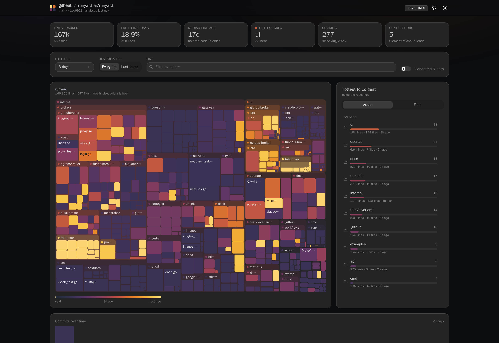

# quanticode

Measurable perspectives on a codebase, so that code nobody hand-wrote can still
be trusted. One perspective so far — **heat**.

**Heat** is a map of a git repository where every file and every line is
coloured by how recently it last changed: recent code glows, untouched code goes
cold. It answers "what is actually moving, and what has been still for years"
before a single file is opened.



## What it shows

**The map** is a squarified treemap of the repository. Area is line count,
colour is heat, and directories keep their children adjacent and carry their own
aggregate heat in the frame and label — so an entire area of the codebase reads
hot or cold before any individual file is examined. Click a folder label to zoom
in; click a file to open it.

**The ranking** puts the same children of the folder in view in a strict
hottest-to-coldest order, so the question can also be answered by reading top to
bottom rather than by hunting for colour. Folders rank ahead of loose files. Each
row names the commit behind its most recent change — the same thing the map's
hover card shows, repeated here because a touch screen has no hover.

**The file view** shows one file line by line, syntax highlighted, each row
carrying the heat of the commit that last touched it. The commit behind the line
under the cursor — or under a tap — is named at the foot of the pane with a link
out to it. The whole-file heat strip down the right edge doubles as the vertical
scrollbar: it shows where the viewport is, and clicking or dragging it moves
there.

**The timeline** is commit activity over a window — 30 days, 90 days, a year or
the whole history — with each bar at its own position on the same heat scale.

The window matters more than it sounds. A twelve-year history drawn at one bar
per week is 640 two-pixel hairlines, and scaling those against the busiest week
of 2014 flattens everything recent to nothing. So the bucket follows the window
(days, weeks or months, whichever keeps the bars readable) and the bars are
scaled within it.

The opening window is chosen from the repository's own activity rather than
fixed, because no fixed value works: the last 30 days of gin-gonic/gin carries
commits on exactly one day, and bubbletea two — both healthy projects a 30-day
chart would draw as abandoned. quanticode takes the shortest window with at
least a dozen active days in it, and a dormant repository is shown whole so it
is clear when it was alive. Picking a window yourself overrides that for good.

## Indexing a repository

Put quanticode in front of a GitHub URL:

```
https://quanticode.dev/github.com/torvalds/linux
```

That is the whole interface. The path after the origin *is* the repository, so
there is no form to fill in, nothing to sign into, and the URL for any project
can be worked out rather than looked up. Pasting a deeper GitHub URL works too —
`/tree/main` and `/blob/main/x.go` are trimmed back to the repository.

Indexing is **lazy**: nothing is cloned until somebody asks for it. The first
request for a repository queues a bare clone and a blame sweep and returns a
progress document; the browser shows the stage it has reached and polls until
the analysis is ready. Everything after that is served from the result.

A clone older than the refresh window (`-refresh`, a day by default) is
re-fetched in the background **while the previous answer is still served**, so a
refresh never makes anyone wait — only a repository nobody has asked for before
does.

Clones are anonymous and ignore the ambient git configuration: no credential
helper, no token, no `url.insteadOf` rewrite from the host. **Public
repositories only** — a private one is indistinguishable from a missing one from
the outside, and is reported as "no such public repository" rather than guessed
at. Only the hosts in `internal/source` are cloned from, currently github.com.

### What an open instance is allowed to spend

Because any stranger can name any repository, every job is bounded:

Oversized repositories are refused **before anything is cloned**: the forge is
asked how big the repository is, which takes well under a second, and a refusal
names the real size. The byte budget below is still enforced during the clone as
a backstop, for a forge that will not say or says something untrue — but it is no
longer how a visitor normally finds out. Discovering that `torvalds/linux` is
6.2 GB by downloading 512 MB of it takes minutes and loads the machine; asking
takes 0.4 seconds.

| flag | default | what it bounds |
| --- | --- | --- |
| `-max-repo-mb` | 512 | one clone; checked against the forge first, then enforced during the clone |
| `-max-files` | 25000 | tracked files, checked before the blame sweep rather than during it |
| `-clone-timeout` | 10m | one clone or fetch |
| `-index-workers` | 2 | repositories cloned and analysed at once |
| `-max-disk-mb` | 20480 | every clone together; the least recently looked at are evicted |
| `-refresh` | 24h | how stale an analysis may get before it is rebuilt |
| `-cache` | user cache dir | where clones are kept |
| `-index=false` | — | turn the whole thing off and serve only `-repo` clones |

A repository that fails to index is remembered for ten minutes rather than
retried on every reload, so a typo'd name cannot be used to keep the workers
busy.

The limits are reported on `/api/instance` and stated on the landing page, so a
visitor reads what will be refused rather than discovering it by waiting.
`QUANTICODE_FORGE_TOKEN` raises the unauthenticated GitHub rate limit for the
pre-flight probe from 60 requests an hour to 5000; it is never used for cloning.

## The heat model

A line's heat is an exponential decay of its age:

```
heat = 0.5 ^ (age / half-life)
```

A line edited right now is `1.0`; one edited a half-life ago is `0.5`; two
half-lives ago `0.25`. The **half-life** is the one knob the reader turns — it
sets what "recent" is being measured against. A week answers "what is this
sprint touching"; a quarter answers "which parts of the architecture are still
moving".

### It is calibrated per repository

A half-life is measured against a project's own pace, so no fixed value works.
A year on authelia/authelia paints 29% of the map hot and the whole thing reads
yellow with no cold background to contrast against; a month paints 12% and it
goes dark. Three months lands on 15% and the structure appears.

Deriving it from the repository's *span* — which is what this used to do — is
the wrong input: authelia and gin-gonic/gin are both about a decade old and want
very different half-lives, because what differs is how recently the code was
last touched, not how long the project has existed.

Two things have to hold at once, and each alone picks a bad answer.

**Maximising spread alone** picks a year on authelia — the very rendering this
is meant to fix — because an even histogram and a legible map are not the same
thing. Every variant does: entropy by line, by file and by root-line-count, and
Otsu separability and plain variance both land on a plateau flat enough to be
noise.

**Targeting a share of hot code alone** is worse, because it has no guard
against overshoot. On a repository written in one burst the hot share jumps from
1.9% at one week straight to 99.9% at one month, so "the first half-life
reaching the target" selects the uniformly orange one.

So quanticode takes **the most spread, among the half-lives that do not wash the
map to the hot end** (more than 18% of lines reading hot). When every half-life
washes out — a repository committed to entirely today — it takes the least
washed, which is the shortest and the only one separating this morning from last
night.

| repository | calibrated | spread | reads hot |
| --- | --- | --- | --- |
| charmbracelet/bubbletea | 1 year | 0.76 | 15% |
| authelia/authelia | 3 months | 0.69 | 15% |
| gin-gonic/gin | 1 year | 0.57 | 3% |
| sindresorhus/slugify | 1 year | 0.54 | 0% |
| clems4ever/github-runner | 1 week | **0.34** | 2% |

### When no half-life works

The last row is not a calibration failure. `github-runner` has 75% of its lines
inside a *0.7-day window*, 27 days ago — the whole repository arrived in one
burst. Heat is monotonic in age, so when every line is the same age every line
is the same colour, whatever half-life is chosen; at one month 86% of the map
lands in a single band and reads as flat orange.

quanticode says so rather than pretending: below a spread of 0.35 the control is
badged **uniform age**, and its tooltip explains that the flatness is itself a
finding — code that arrives all at once usually came from one import or one
generated burst. For a tool meant to give humans a reason to trust code they did
not write, "this all appeared at the same moment" is worth surfacing, not
hiding.

Because the value is preselected, the control says so: an **auto** badge sits
next to it, and its tooltip gives the figure the calibration was working from.
Choosing a half-life by hand replaces the badge with **reset**.

A file's heat is the line-weighted mean of its lines' heat (**Every line**), so
a 500-line file where one line changed yesterday is correctly cold. Switch to
**Last touch** to colour by the single most recent edit instead.

A directory's heat is recomputed from the merged lines of everything beneath it,
not averaged from its children's heat — so one huge cold file and one tiny hot
one land where the line counts say they should.

### The colour scale

One sequential ramp, because heat is one magnitude. It runs cold slate → violet
→ ember → amber, strictly monotonic in lightness, with its own steps per mode:
on dark the hot end is the bright one, on light the hot end is the dark one, so
"hot" is always the salient end against the surface it is drawn on.

That gate is a test, not a script somebody has to remember to run: `npm test`
checks lightness monotonicity, hot-end contrast and lightness span for both
ramps, so a colour change that breaks the encoding fails CI.

Heat is also encoded by bar length in the rankings, so the ordering survives
without colour.

## Generated and data files

Lock files, vendored and generated code, tool caches and bulk data are hidden by
default: they distort both size and heat without reflecting anyone's work. One
230k-line tool cache was swamping a map trying to show where people work. The
toggle brings them back. Detection covers `vendor/`, `node_modules/`, `gen/`,
`*-gen/` output directories, top-level dot-directories other than `.github`,
`*.gen.go` / `*.pb.go`, lock files, and data-extension files past 2000 lines.

## Running it

### With Docker

```sh
docker run --rm -p 8090:8090 -v quanticode-cache:/cache \
  ghcr.io/clems4ever/quanticode:latest -cache /cache
```

Then open <http://localhost:8090/github.com/torvalds/linux>, or any other
repository. The volume keeps the clones across restarts.

To serve a local clone instead of indexing remote ones, mount it and name it:

```sh
docker run --rm -p 8090:8090 \
  -v /path/to/a/git/clone:/repo:ro \
  ghcr.io/clems4ever/quanticode:latest \
  -repo myrepo=/repo
``` Images are published for `linux/amd64` and
`linux/arm64` on every release, tagged `latest`, `X.Y.Z`, `X.Y` and `X`.

Mount the repository read-only — quanticode only ever reads. It runs as a non-root
user and reads a clone owned by whatever uid the host uses, which git would
normally refuse as "dubious ownership"; the image sets `safe.directory` through
the environment so it works under any `--user` and without a writable HOME.

Serve several repositories by repeating the flag and the mount:

```sh
docker run --rm -p 8090:8090 \
  -v ~/code/api:/repos/api:ro -v ~/code/web:/repos/web:ro \
  ghcr.io/clems4ever/quanticode:latest \
  -repo api=/repos/api -repo web=/repos/web
```

The repository is then chosen with `?repo=<slug>`. To give each one its own
address instead, run one container per repository on its own port.

### From source

Needs Go 1.22+ and Node 20+, and a local clone of whatever you want to look at.
The Go side has no dependencies outside the standard library.

```sh
make install                          # frontend dependencies
make run REPO=/path/to/a/git/clone    # build both, then serve on :8090
```

Or by hand:

```sh
cd web && npm install && npm run build && cd ..
go build -o quanticode ./cmd/quanticode
./quanticode -addr :8090 -repo myrepo=/path/to/clone -web web/dist
```

`-repo` is repeatable (`name=/path`, or just `/path`), and the repository is
chosen with `?repo=<slug>`. To give each repository its own address, run one
instance per repo on its own port — that is what `./run.sh` does.

For frontend work, `npm run dev` in `web/` proxies `/api` to `127.0.0.1:8099`.

## Development

```sh
make test     # Go tests with -race, plus the frontend suite
make lint     # gofmt, go vet, oxlint, tsc
make help     # everything else
```

Both run in CI on every push and pull request, along with a job that builds the
Docker image and smoke-tests it by serving the checkout through it — so a
release is never the first time anyone finds out the image is broken.

The Go tests build real throwaway git repositories with pinned commit times
(`internal/testrepo`) and assert against actual blame output, rather than
mocking git — blame's line attribution is the one thing the whole app rests on,
so it is worth testing for real. The frontend tests cover the heat model, the
tree aggregation, the summary statistics and the colour ramps.

## How it works

The backend shells out to `git blame --line-porcelain -M -w` once per tracked
file across a worker pool, and reduces each file to the line counts grouped by
last-edit timestamp. Binary files are excluded by a single `git grep -I` for the
whole repository rather than a `git show` per file. That aggregate is a few
hundred numbers per file, so a small repository ships as one ~35 KB gzipped
payload and every control (half-life, metric, filter, zoom) is recomputed in the
browser with no round trip. Per-line blame is fetched on demand when a file is
opened.

**The sweep is the cost, and it scales with history depth rather than file
count.** Measured on a loaded eight-core box, so treat these as the shape rather
than as a benchmark:

| repository | files | commits | sweep | payload |
| --- | --- | --- | --- | --- |
| clems4ever/quanticode | 68 | 5 | 0.7s | 2 KB |
| gin-gonic/gin | 130 | 2,011 | 8s | 114 KB |
| authelia/authelia | 3,359 | 10,526 | **2m 40s** | 373 KB |

Authelia is about 150ms of blame per file, roughly 500 CPU seconds of work, and
there is no trick available: dropping `-M` was measured and is *slower*. So the
sweep reports real progress — files completed, and a separate stage for the
roll-up afterwards, which is another fifteen seconds on a history that size —
rather than pretending it is quick. A repository that size is a first-visit wait
of minutes, and only once.

Results are cached per HEAD,
so a reload is free until the repository actually moves.

```
cmd/quanticode/     flag parsing and process wiring, nothing else
internal/gitrepo/   git commands: list, blame, binary and generated detection
internal/heat/      the blame sweep and the per-file aggregates (the heat lens)
internal/source/    the URL shape: host/owner/repo, parsed and validated
internal/index/     lazy on-demand cloning, refresh, limits and eviction
internal/forge/     asks a host about a repository before it is cloned
internal/server/    HTTP API, gzip, static hosting of the SPA
internal/testrepo/  builds throwaway git repos for the tests
web/                React + TypeScript + Mantine
```

## Releasing

Every release is a tag, and the tag is what publishes.

Actions → **Release** → *Run workflow*, then choose **patch**, **minor** or
**major**. The next version is derived from the highest existing `v*` tag —
`v0.4.2` plus *minor* is `v0.5.0`, and a repository with no tags yet starts from
`v0.0.0`, so the first *minor* release is `v0.1.0`. Pre-release tags are skipped
when working out where you are, so an `-rc` never becomes the base for a bump.

From there the workflow runs the whole CI suite against the commit being
released, creates and pushes the tag, builds the multi-arch image, pushes it to
GHCR, pulls it back and checks it actually serves a repository, then cuts the
GitHub release with generated notes and the `Dockerfile` that built the image
attached as an asset.

Pushing a `v*` tag by hand does the same thing, minus the tag creation — use
that when you want to name the version exactly rather than bump it.

A version containing a hyphen (`v0.3.0-rc.1`) is treated as a pre-release, as is
anything released with the pre-release box ticked: it publishes under its exact
version only, and does not move `latest`, `X.Y` or `X`.

## Licence

[Apache 2.0](LICENSE).
